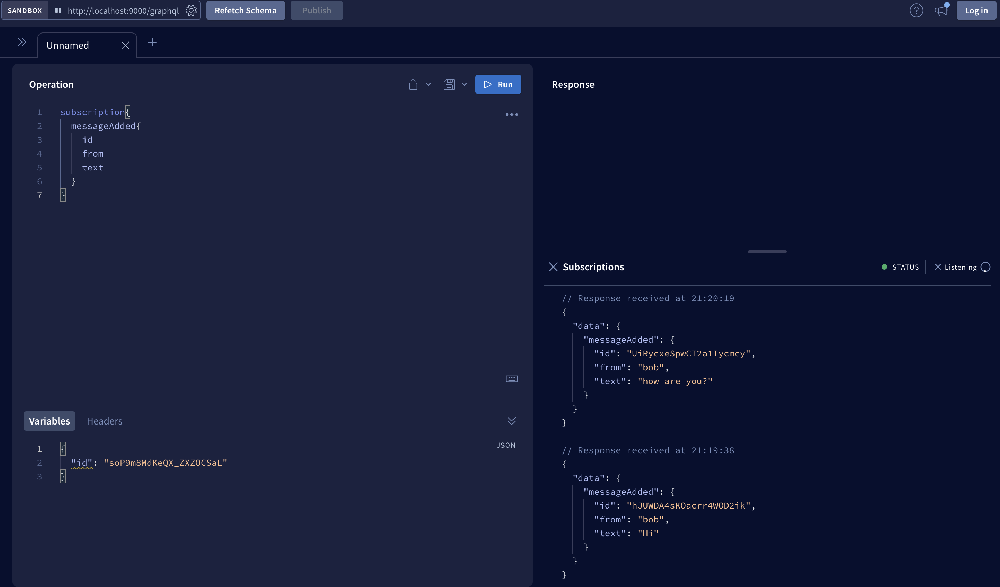

# Chat GraphQL

FullStack Web App.

The main purpose is to implement and explore graphQL subscriptions features.

We can use the local cache that GraphQL provides to append the new messages that the users just sent. But we want to also receive real time updates, for that we need to use subscriptions.

### 1. Add your Subscription Schema

Server > schema.graphql:

```
type Subscription {
  messageAdded: Message
}
```

Our server now must support WS protocols, which stands for "Web Sockets".

With normal HTTP request, every connection between the client and the server is closed when the response is received. If we want to fetch more data we need to do a hole new connection.

With Web Sockets the client and the server starts a connection that stays open, the server may not have no data to send, but as soon as there is new data the server sends the data in the same channel.

### 2. Configure Server to handle Web Sockets

There are 2 packages to handle GraphQL over web sockets.

- subscriptions-transport-ws (no longer maintained)
- graph-ws [GraphQL Over Websocket] (new package)

We need to also install the ws package which supports the low level web socket.

```
npm install graphql-ws ws @graphql-tools/schema

```

Server > server.js

```
import { ApolloServer } from "apollo-server-express";
import cors from "cors";
import express from "express";
import { expressjwt } from "express-jwt";
import { readFile } from "fs/promises";
import jwt from "jsonwebtoken";
import { User } from "./db.js";
import { resolvers } from "./resolvers.js";
import { createServer as createHttpServer } from "http";
import { makeExecutableSchema } from "@graphql-tools/schema";
import { WebSocketServer } from "ws";
import { useServer as useWsServer } from "graphql-ws/lib/use/ws";

const PORT = 9000;

const app = express();

// ...
// ... other code here ..
// ...

// handle both Http and WS servers
const httpServer = createHttpServer(app);
const wsServer = new WebSocketServer({ server: httpServer, path: "/graphql" });

const typeDefs = await readFile("./schema.graphql", "utf8");

// create executable schema
const schema = makeExecutableSchema({ typeDefs, resolvers });

// user WebSockets
useWsServer({ schema }, wsServer);

const apolloServer = new ApolloServer({
  schema,
  context: getContext,
});
await apolloServer.start();
apolloServer.applyMiddleware({ app, path: "/graphql" });

// update
httpServer.listen({ port: PORT }, () => {
  console.log(`Server running on port ${PORT}`);
  console.log(`GraphQL endpoint: http://localhost:${PORT}/graphql`);
});

```

### 3. Add the Resolver for the subscription schema.

Subscriptions must return a **subscribe()** function and return an **Async Iterator**.

We can use the `graphql-subscriptions` package which handles this using a PubSub approach.

`npm i graphql-subscriptions`

In Server > resolver.js

```
import { Message } from "./db.js";
import { PubSub } from "graphql-subscriptions";

const pubSub = new PubSub();

export const resolvers = {

  Mutation: {
    addMessage: async (_root, { input }, { userId }) => {
      rejectIf(!userId);

      const message = await Message.create({ from: userId, text: input.text });

      // when someone in the chat publish a new message, then notify to all users in the channel.
      pubSub.publish("MESSAGE_ADDED", { messageAdded: message });

      return message;
    },
  },

  Subscription: {
    messageAdded: {
      subscribe: () => pubSub.asyncIterator("MESSAGE_ADDED"),
    },
  },
};


```

Testing using Apollo Server SandBox



### 4. Update Apollo Client in the Frontend

In the client project:

```
npm install graphql-ws
```

Inside client.js:

```
import { ApolloClient, HttpLink, InMemoryCache, split } from "@apollo/client";
import { GraphQLWsLink } from "@apollo/client/link/subscriptions";
import { createClient as createWSClient } from "graphql-ws";
import { getMainDefinition } from "@apollo/client/utilities";
import { Kind, OperationTypeNode } from "graphql";

const GRAPHQL_URL = "http://localhost:9000/graphql";

const httpLink = new HttpLink({ uri: GRAPHQL_URL });

const wsLink = new GraphQLWsLink(
  createWSClient({ url: "ws://localhost:9000/graphql" })
);

function isSubscription({ query }) {
  // check if the GraphQL is a subscription to decide if use the WS or HTTP link
  const definition = getMainDefinition(query);
  return (
    definition.kind === Kind.OPERATION_DEFINITION &&
    definition.operation === OperationTypeNode.SUBSCRIPTION
  );
}

export const client = new ApolloClient({
  link: split(isSubscription, wsLink, httpLink), // works like and if
  cache: new InMemoryCache(),
});

export default client;

```

### 5. Add the Subscription Query

In client > queries.js:

```
export const MESSAGE_ADDED_SUBSCRIPTION = gql`
  subscription MessageAddedSubscription {
    message: messageAdded {
      id
      from
      text
    }
  }
`;

```

In client > hooks.js

```
import { useMutation, useQuery, useSubscription } from "@apollo/client";
import { getAccessToken } from "../auth";
import {
  ADD_MESSAGE_MUTATION,
  MESSAGES_QUERY,
  MESSAGE_ADDED_SUBSCRIPTION,
} from "./queries";

export function useMessages() {
  const { data } = useQuery(MESSAGES_QUERY, {
    context: {
      headers: { Authorization: "Bearer " + getAccessToken() },
    },
  });

  useSubscription(MESSAGE_ADDED_SUBSCRIPTION, {
    // we get notified of new messages
    onSubscriptionData: ({ client, subscriptionData }) => {
      console.log("subscription data: ", subscriptionData);
      const message = subscriptionData.data.message;

      // update local cache
      client.cache.updateQuery({ query: MESSAGES_QUERY }, (oldData) => {
        // append the new message to the list of messages
        const newData = {
          messages: [...oldData.messages, message],
        };
        return newData;
      });
    },
  });

  return {
    messages: data?.messages ?? [],
  };
}


```

### 6. Add Authentication

Only allow authenticated users to send messages.

Http and WebSockets are different protocols, in WS we don't have the headers properties to send the auth token.

That is one of the reasons why authentication is always a separate layer of our app.

#### Update Frontend

In Client > client.js

```
import { getAccessToken } from "../auth";

const GRAPHQL_URL = "http://localhost:9000/graphql";

const httpLink = new HttpLink({ uri: GRAPHQL_URL });

const wsLink = new GraphQLWsLink(
  createWSClient({
    url: "ws://localhost:9000/graphql",
    connectionParams: () => ({ accessToken: getAccessToken() }),
  })
);

```

We send teh token as a Connection Param, the token is send in the initial connection message.

#### Update Backend

We create a context for WebSockets requests.

We use the connectionParams in the backend to get the access token passed in by the Frontend.

Then we pass that information to the resolvers using a new context.

In server.js:

```
function getHttpContext({ req }) {
  if (req.auth) {
    return { userId: req.auth.sub };
  }
  return {};
}

// new context for Web Sockets:

function getWsContext({ connectionParams }) {
  const token = connectionParams?.accessToken;
  if (token) {
    const payload = jwt.verify(token, JWT_SECRET);
    return { userId: payload.sub };
  }
  return {};
}

const httpServer = createHttpServer(app);
const wsServer = new WebSocketServer({ server: httpServer, path: "/graphql" });

const typeDefs = await readFile("./schema.graphql", "utf8");

const schema = makeExecutableSchema({ typeDefs, resolvers });

useWsServer({ schema, context: getWsContext }, wsServer);

const apolloServer = new ApolloServer({
  schema,
  context: getHttpContext,
});
await apolloServer.start();
apolloServer.applyMiddleware({ app, path: "/graphql" });
```

Then update the resolver to get the auth data from the context, and use it to reject or not the request.

In resolver.js :

```
function rejectIf(condition) {
  if (condition) {
    throw new Error("Unauthorized");
  }
}


export const resolvers = {

  Subscription: {
    messageAdded: {
      subscribe: (_root, _args, context) => {
        const { userId } = context;
        rejectIf(!userId);
        return pubSub.asyncIterator("MESSAGE_ADDED");
      },
    },
  },
};
```
